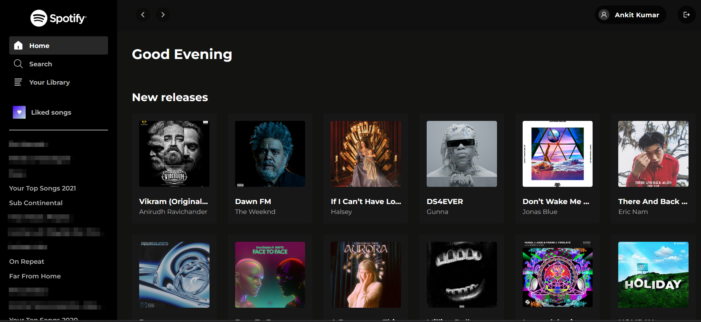
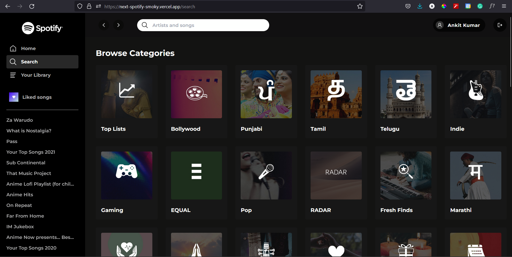
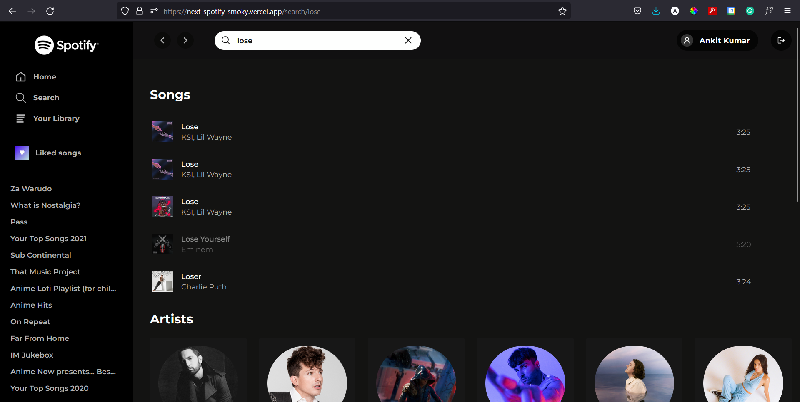
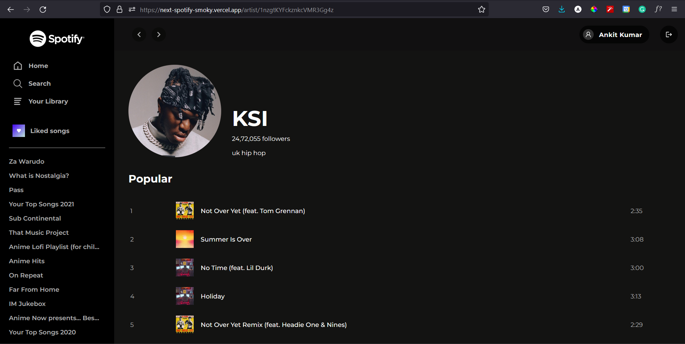
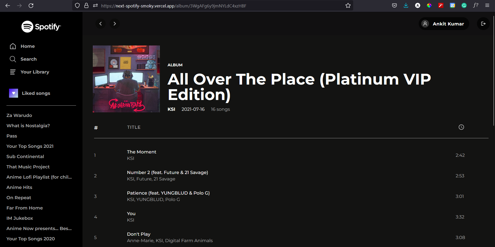
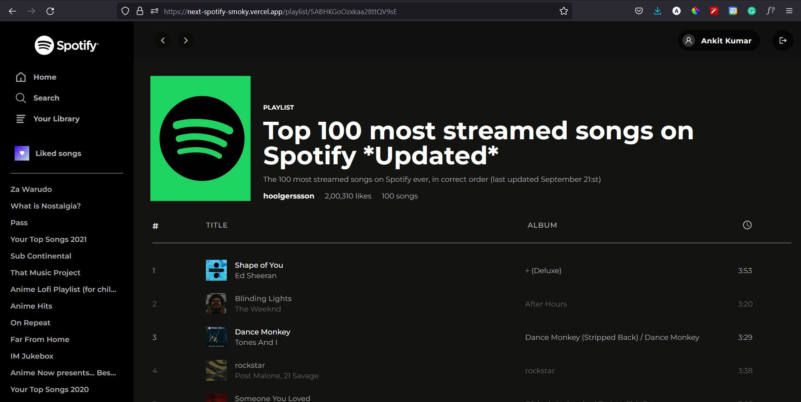
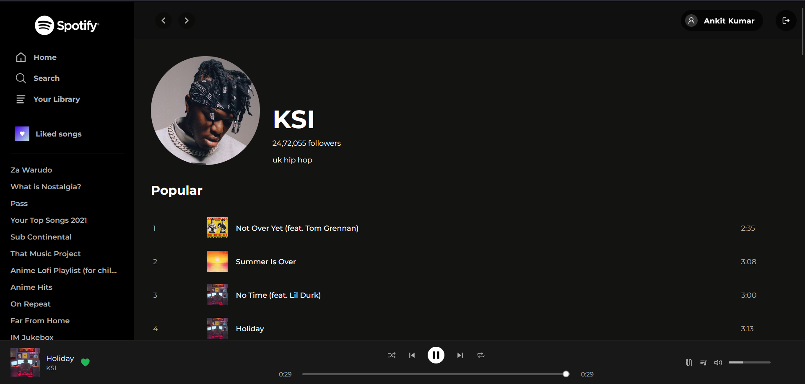

# Next Spotify


Next Spotify is a Spotify clone built using Next.js and TailwindCSS. Users can log in with their Spotify account and view the playlists, artists, and albums followed by them.

Working demo for the project - [Link](https://next-spotify-smoky.vercel.app)

## *Update*  
Next-Spotify v2 is out in this [repository](https://github.com/ankitk26/Next-Spotify-v2). Check this out if you are interested in Next.js's app dir, server components, client components, and improved UI.

<b>Note </b>: Currently users cannot log in to the demo link. The application would work in the local system.

## Table of contents

- [Technologies and Libraries used](#technologies)
- [Features](#features)
- [To-do features](#todo)
- [Run locally](#run_locally)
- [Environment variables](#env)
- [Data flow](#data_flow)
- [API Reference](#api)
- [Screenshots](#screenshots)
- [Resources](#resources)


<section id="technologies" />

## Technologies and Libraries used

- [Next.JS 12](https://nextjs.org/)
- Typescript
- [TailwindCSS](https://tailwindcss.com/)
- [NextAuth.js](https://next-auth.js.org/) for Spotify OAuth authentication


<section id="features"/>

## Features

- Log-in into the application using Spotify OAuth through the next-auth package
- View all the playlists created or followed by the user
- View liked songs playlist of the user
- View artists and albums followed by the user
- Display all the tracks in a playlist, an album, or of an artist
- Play a track with play/pause controller
- Search for any playlist, artist, album, or track
- Browse music based on categories (eg: Rock, Indie, Hip-Hop)
- Show latest releases

<section id="todo" />

## To-do features

- [ ] Infinite pagination
- [ ] Add colors to headers
- [ ] Improve track player
- [ ] Shuffle play or play all tracks in album or playlist

*Any other features can be suggested under the issues section of the repo*
<section id="run_locally"/>

## Run Locally

Clone the project

```bash
  git clone https://github.com/ankitk26/Next-spotify.git
```

Go to the project directory

```bash
  cd Next-spotify
```

Install dependencies

```bash
  npm install
  # or
  yarn
```


Start the server

```bash
  npm run dev
  # or
  yarn dev
```


<section id="env"/>

## Environment Variables

To run this project, you will need to add the following environment variables to your .env file

`SPOTIFY_CLIENT_SECRET`

`SPOTIFY_CLIENT_ID`

`NEXTAUTH_URL`= http://localhost:3000

`NEXTAUTH_SECRET`

#### Spotify API credentials

- **Step 1**: Go to the [Spotify's developer dashboard](https://developer.spotify.com/dashboard/) and log in with your Spotify credentials
- **Step 2**: Click on **CREATE AN APP** button on the applications page. Enter the name and description for the application.
- **Step 3**: After creating the application, copy the **Client ID** and **Client Secret** and paste it into the .env file.
- **Step 4**: In the application page itself, click on **Edit Settings** button. Under the **Redirect URIs** section, add the redirect URL in the text field provided as follows:

  `http://localhost:3000/api/auth/callback/spotify`

  When the project is deployed, add another redirect URL as follows:

  `https://xyz.domain/api/auth/callback/spotify`
- **Step 5**: In the **Users and Access** page, add the email addresses for the accounts you want to test the application for. Your own account is enabled by default so no there's no need to add your own account's email.

#### NEXTAUTH_SECRET

To create a secret key, open your terminal, run the command below and copy the value generated to the .env file.

~~~bash
openssl rand -base64 32
~~~


<section id="data_flow"/>

## Data flow


<section id="api"/>

## API Reference

The API endpoints and their response are listed in [https://developer.spotify.com/console/](https://developer.spotify.com/console/)

<section id="screenshots"/>

## Screenshots

**Home page**



<br><br>

**Browse categories**



<br><br>

**Search**



<br><br>

**View Artist**



<br><br>

**View Album**



<br><br>

**View Playlist**



<br><br>

**Music player**



<section id="resources"/>

## Resources

- [Spotify Web API documentation](https://developer.spotify.com/console/)
- Font used - [Montserrat](https://fonts.google.com/specimen/Montserrat)
- [NextAuth.js Documentation](https://next-auth.js.org/getting-started/example)
- [NextAuth.js Spotify Provider](https://next-auth.js.org/providers/spotify)
